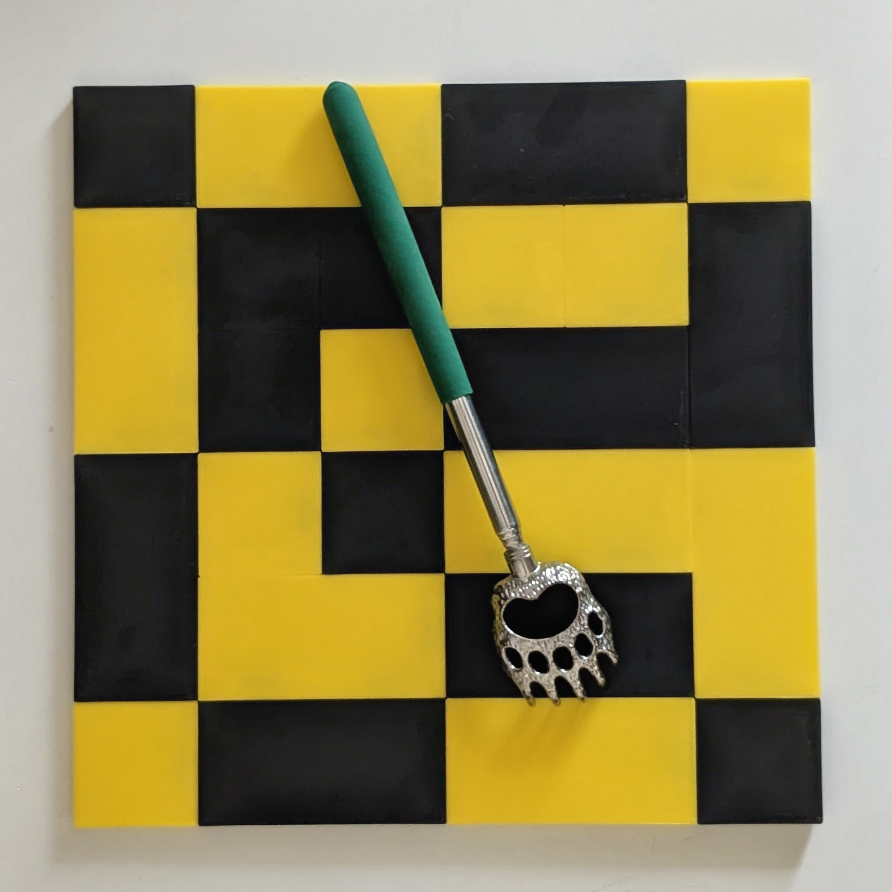

# **GridLink™**

A 3D printable system of interlocking square tiles for functional and creative panel design, with finger joint and hinges to turn those panels into various boxes and box-like structures. Supports wall art, 3D printer side panels, boxes and drawers, 3D printer side hats, placemats, etc. 

There are two main types of GridLink: "Jigsaw" and "Hidden Fastener". GridLink Jigsaw™ series are very fast, functional and easy to build. GridLink Hidden Fastener™ series present a user's design most elegantly, but are a little harder to build. Ironically, the hidden fastener series are more like puzzles to design and put together, whereas the Jigsaw series just work and are easy to revise.

Each of these two main types has 3 variants, being the lightest duty, a medium duty and the most robust and insulating parts for steel reinforced weight-bearing roles. And there will be occasional special purpose sets, such as for Chess, which requires several custom parts for a truly tournament compatible board. An overview of the different series follows:
   

### GridLink Play™ (GLJ4004-100-Q)
 has 40 x 4mm base tiles with visible jigsaw connectors and rounded edges and corners. Tolerance is relatively loose, being just structural enough to generally hold together when a panel is picked up. Best used as a children's toy, for creating colorful designs with tactile real pieces. And of course for being torn apart and reimagined into something else.
   

### GridLink Art™ (GLU4006-100)
uses 40 x 6mm base tiles with hidden (covered) jigsaw connectors, creating sharply defined patterns of squares. These can be disassembled and reused, but they hold well and are intended for both play and creation of up to permanent functional pieces, color patterns and art. This is the only "hidden fastener" series that is thin enough to bend slightly, making it usually possible to proceed even if you build yourself into a jam.

GridLink Art is especially well suited to large-pixel art, such as the various faces from Minecraft. As finger joint and hinge pieces are released it will serve well for light-duty structural pieces, such as a jewelry or pencil box, etc.
   

### GridLink Build™ (GLJ5012-025-R4M3)
uses 50 x 12mm base tiles in an upsized and structural version of GridLink Play. It has mallet-tight tolerances, channels for 4mm steel rod reinforcements and M3 mounting holes on the back. This is for use in building beautifully functional panels, sliding-lid boxes, small chests of drawers, etc. And of course it's original purpose, which was for expansion panels (A.K.A. side-packs, backpacks or top hats) for Voron and other 3D printers.

GridLink Build is designed to be simple and quick to use, sitting at the sweet spot of high functionality with low print cost.
   

### GridLink Design™ (GLU5012-025-R4M3)
uses 50 x 12mm base tiles in a hidden fastener version of GridLink Build. It is useful for all of the same purposes, but trades simplicity for a clean no-fastener appearance. The covers that hide the fasteners make assembly require more planning and care. But the result can be very satisfying and looks especially great.
   

### GridLink Forge™ (GLJ5020-050-R4M5)
With 50 x 20mm base squares, M5 mounting holes and channels for 4mm steel rod reinforcements, there is not much in the way of insulated panels that this can't support. This is the most structural and most insulating GridLink series, including parts for both panels and box-type structures in 20mm thick parts.[^1]
   

### GridLink Prime™ (GLU5020-050-R4M5)
The hidden connector companion to GridLink Doom, for those times when you need everything, and sharply defined squares too.
   

### GridLink Chess™ (GLU5719-050-M14)
Creating a chessboard for a school chess club is one of the original motives for creating GridLink. This is a chessboard-specific GridLink series, FIDE compliant with traditional 2 1/4" (57.15mm) x 3/4" (19.05mm) squares. Non-chess-specific parts will be included for those wanting a GridLink series in English units. At this thickness it looks and feels very premium. Holes have been placed in the bottom center of squares to allow up to a 10mm magnet. Parts are included for both hidden barrel hinges or magnetic board assembly for where a portable option is needed.

Thanks Dimitru for good suggestions around portable boards and magnets.

[^1]: Some parts referenced are being validated and are not yet released.

