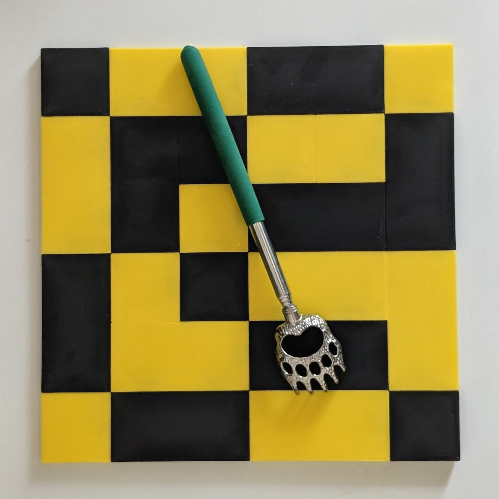

# GridLink
A 3D printable system of interlocking square tiles, for both utilitarian and artistic creation. Supports creation of wall art, 3D printer side panels, boxes and drawers, 3D printer side hats, placemats, etc. Also a great medium for pattern and color exploration as a children's toy.

